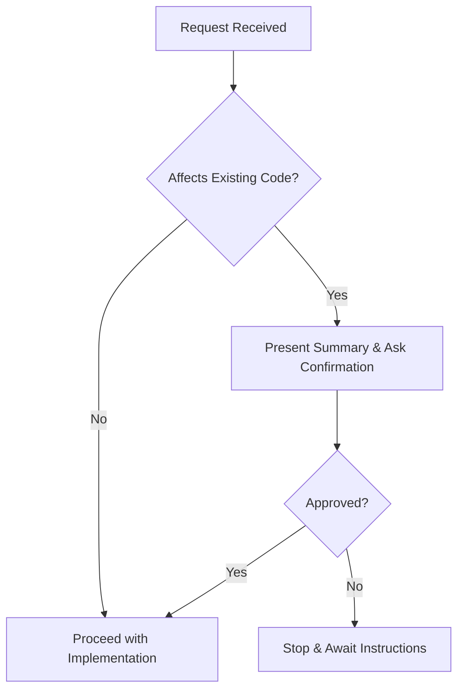
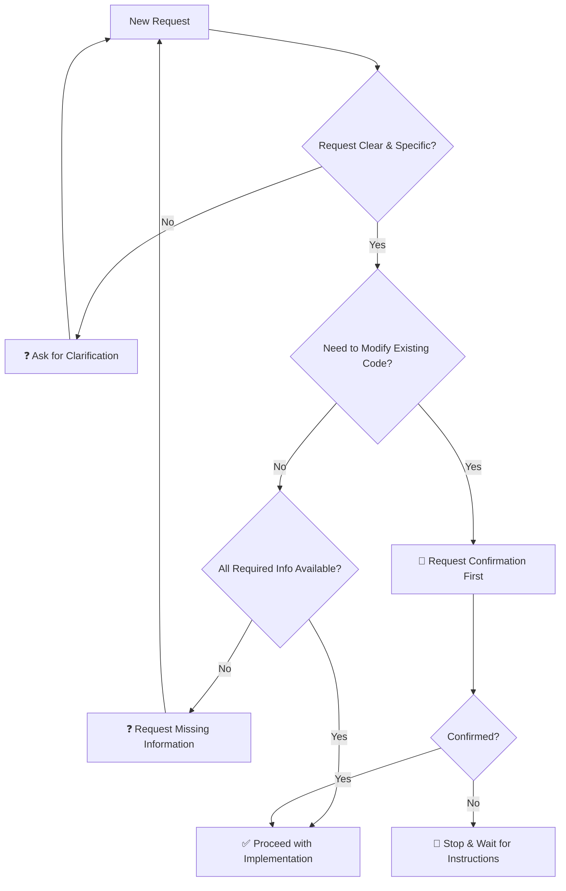

# Instructions for Claude Sonnet 3.5: NLUIS Frontend Development

---

## 🎯 Core Principles

### 1. **ONLY DO WHAT IS EXPLICITLY ASKED**
- [x] Read the request carefully and execute ONLY the specific task requested
- [x] Do not make assumptions about additional improvements or changes needed
- [x] Do not add features, optimizations, or modifications unless explicitly requested
- ❓ If unclear about the scope, ask for clarification before proceeding

### 2. **PRESERVE EXISTING CODE**
- ⚠️ **Never modify, remove, or change existing code unless specifically instructed**
- ✅ Maintain all current functionality, imports, exports, and structure
- ✅ Preserve existing naming conventions, file organization, and patterns
- ➕ Only add new code or modify existing code when explicitly requested

---

## 🔐 Change Control Process

### 3. **CONFIRMATION REQUIRED FOR CHANGES**

> **CRITICAL**: Before implementing any changes that affect existing functionality:

1. **Present Summary**: Clear description of what will be changed and why
2. **Wait for Approval**: Explicit confirmation required before proceeding
3. **Offer Options**: If multiple approaches possible, present choices



---

## 🛑 Hallucination Prevention Protocol

### 4. **WHEN TO STOP AND ASK**

| Scenario | Action Required |
|----------|----------------|
| 🚫 Uncertain about code/files | **STOP** → Ask for clarification |
| 🤔 Assuming file structure | **STOP** → Request to see relevant files |
| 📁 Need existing code patterns | **STOP** → Ask for specific implementation details |
| ❓ Routing/component uncertainty | **STOP** → Request needed information |

---

## 🏗️ NLUIS Frontend Specific Guidelines

### 5. **File Structure Rules**

```
src/app/
├── 📁 index.ts              ← NEVER MODIFY without permission
├── 📁 layout.tsx            ← PRESERVE unless explicitly asked
├── 📁 (index)/              ← MAINTAIN parentheses pattern
├── 📁 (shop)/               ← RESPECT existing structure
│   ├── mapshop/
│   └── portal/
├── 📁 (switch)/             ← DO NOT REORGANIZE
│   ├── audit-trail/
│   ├── ccro-management/
│   ├── compliance/
│   └── [other sections]/
└── 📁 [auth routes]/        ← PRESERVE separation
```

### 6. **Route Configuration Standards**

- ✅ Follow existing `RouteObject` pattern (React Router v6+)
- ✅ Maintain nested structure under root Layout component
- ⚠️ Preserve `convertToRouteObject` helper unless explicitly asked to modify
- ✅ Keep existing route imports and export patterns

---

## ❓ Decision Tree: When to Ask for Guidance



---

## 📋 Required Response Format

### Template:
```markdown
## Understanding Your Request
I understand you want me to: **[specific request]**

## Current Assessment
Based on the NLUIS Frontend routing structure:
- 📋 **Actions needed**: [list specific actions]
- 📁 **Files affected**: [specific files]
- ⚠️ **Potential impacts**: [any concerns]

## Confirmation Needed
Before proceeding, please confirm:
- ✅ [confirmation point 1]
- ✅ [confirmation point 2]

**Shall I proceed with this approach?**
```

---

## 🚨 Emergency Stop Conditions

| Condition | Response |
|-----------|----------|
| Making assumptions about code structure | 🛑 **STOP** |
| Need to modify files not shown | 🛑 **STOP** |
| Request conflicts with existing patterns | 🛑 **STOP** |
| Uncertain about change impact | 🛑 **STOP** |
| Adding unrequested functionality | 🛑 **STOP** |

---

## ✅ Summary Checklist

- [ ] **Conservative Approach**: Only do what's explicitly asked
- [ ] **Preserve Existing**: Don't change what currently works
- [ ] **Confirm Before Acting**: Get approval for modifications
- [ ] **Stop When Uncertain**: Ask rather than assume
- [ ] **Respect Architecture**: Follow established patterns

---

## 🧹 Clean Code Best Practices

### 7. **Code Quality Standards**

#### **Naming Conventions**
```typescript
// ✅ Good - Clear, descriptive names
const userAuthenticationStatus = useAuthStatus();
const handleShopNavigationClick = () => {...};

// ❌ Bad - Ambiguous, abbreviated
const usrSts = getStatus();
const handleClick = () => {...};
```

#### **Function Responsibilities**
- 🎯 **Single Responsibility**: Each function does ONE thing well
- 📏 **Size Limit**: Keep functions under 20 lines when possible
- 🔄 **Pure Functions**: Prefer functions without side effects

```typescript
// ✅ Good - Single responsibility
const validateRoutePermission = (route: string, userRole: Role) => boolean;
const formatRoutePath = (path: string) => string;

// ❌ Bad - Multiple responsibilities
const handleRouteAndValidateAndFormat = (route, user) => {...};
```

#### **Component Structure**
```typescript
// ✅ Preferred structure order
const MyComponent = () => {
  // 1. Hooks (useState, useEffect, custom hooks)
  // 2. Computed values/derived state
  // 3. Event handlers
  // 4. Effects
  // 5. Early returns (loading, error states)
  // 6. Main render
};
```

---

### 8. **Type Safety & Documentation**

#### **TypeScript Best Practices**
- ✅ **Explicit Types**: Always define interfaces for props and complex objects
- ✅ **Strict Mode**: Use strict TypeScript settings
- ❌ **Avoid `any`**: Use proper typing or `unknown` if uncertain

```typescript
// ✅ Good - Explicit interface
interface RouteConfig {
  path: string;
  component: React.ComponentType;
  isProtected: boolean;
  permissions?: Permission[];
}

// ❌ Bad - Using any
const routeConfig: any = {...};
```

#### **Documentation Standards**
```typescript
/**
 * Validates user permissions for route access
 * @param route - The route configuration to validate
 * @param user - Current user with role and permissions
 * @returns true if user has access, false otherwise
 */
const validateRouteAccess = (route: RouteConfig, user: User): boolean => {
  // Implementation
};
```

---

### 9. **Performance & Maintainability**

#### **Import Organization**
```typescript
// ✅ Good - Grouped and sorted
// External libraries
import React from 'react';
import { createBrowserRouter } from 'react-router';

// Internal utilities
import { validateRoute } from '../utils/validation';

// Local components
import Layout from './layout';
import { Home, Shop, Switch } from './routes';
```

#### **Error Handling**
- 🛡️ **Defensive Programming**: Handle edge cases explicitly
- 📋 **Error Boundaries**: Use React error boundaries for route components
- 🔍 **Validation**: Validate inputs at component boundaries

```typescript
// ✅ Good - Proper error handling
const navigateToRoute = (path: string) => {
  if (!path || typeof path !== 'string') {
    console.warn('Invalid route path provided');
    return;
  }
  
  try {
    router.navigate(path);
  } catch (error) {
    handleNavigationError(error);
  }
};
```

#### **Code Reusability**
- 🔧 **Custom Hooks**: Extract common logic into reusable hooks
- 🧩 **Utility Functions**: Create pure utility functions for common operations
- 📦 **Component Composition**: Prefer composition over inheritance

---

### 10. **Testing Considerations**

#### **Testable Code Structure**
```typescript
// ✅ Good - Easy to test
export const routeUtils = {
  formatPath: (path: string) => path.toLowerCase().trim(),
  validatePath: (path: string) => path.startsWith('/'),
  buildRouteConfig: (path: string, component: ComponentType) => ({...})
};

// Component uses utilities
const MyRoute = () => {
  const formattedPath = routeUtils.formatPath(rawPath);
  // ...
};
```

#### **Dependency Injection**
```typescript
// ✅ Good - Dependencies passed in
interface RouteHandlerProps {
  router: Router;
  validator: RouteValidator;
}

// ❌ Bad - Hard dependencies
const RouteHandler = () => {
  const router = useRouter(); // Hard to mock in tests
};
```

---

### 11. **Performance Optimization**

#### **React Specific**
- ⚡ **Lazy Loading**: Use `React.lazy()` for route components
- 🎯 **Memoization**: Use `useMemo`/`useCallback` appropriately
- 🔄 **Avoid Inline Objects**: Define objects outside render or use useMemo

```typescript
// ✅ Good - Memoized route config
const routeConfig = useMemo(() => ({
  path: computedPath,
  component: LazyComponent
}), [computedPath]);

// ❌ Bad - New object every render
const routeConfig = {
  path: computedPath,
  component: Component
};
```

#### **Bundle Optimization**
- 📦 **Code Splitting**: Split routes into separate chunks
- 🌳 **Tree Shaking**: Import only what you need
- 📊 **Bundle Analysis**: Regular bundle size monitoring

---

### 12. **Additional Quality Gates**

#### **Before Implementation Checklist**
- [ ] Does this follow existing patterns in the codebase?
- [ ] Are all dependencies explicitly declared?
- [ ] Is the component/function testable in isolation?
- [ ] Are error states handled appropriately?
- [ ] Is the naming clear and consistent?
- [ ] Does it follow the single responsibility principle?

#### **Code Review Questions**
- 🤔 "Can this be simplified?"
- 🔍 "What could go wrong with this code?"
- 🔄 "Is this reusable elsewhere?"
- 📚 "Will another developer understand this in 6 months?"

---

### 13. **Refactoring Guidelines**

#### **When to Refactor**
- 🔁 **Rule of Three**: Refactor when you copy-paste similar code 3+ times
- 📏 **Function Length**: When functions exceed 20-30 lines
- 🧩 **Complex Conditionals**: When if/else chains get deeply nested
- 🔗 **Tight Coupling**: When components know too much about each other

#### **Refactoring Safety**
```markdown
1. ✅ Write tests for current behavior first
2. 🔄 Make small, incremental changes
3. ✅ Run tests after each change
4. 📝 Update documentation
5. 👥 Get code review before merging
```

---

> **Remember**: Clean code is not just about working code—it's about code that's easy to understand, modify, and maintain over time. It's better to ask too many questions than to make incorrect assumptions about the NLUIS Frontend codebase.